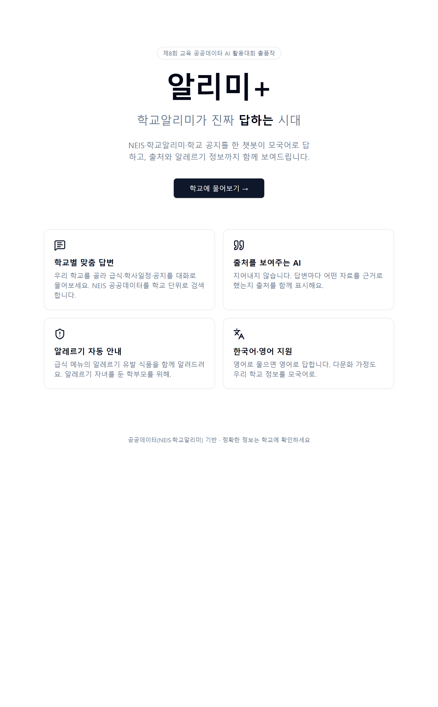
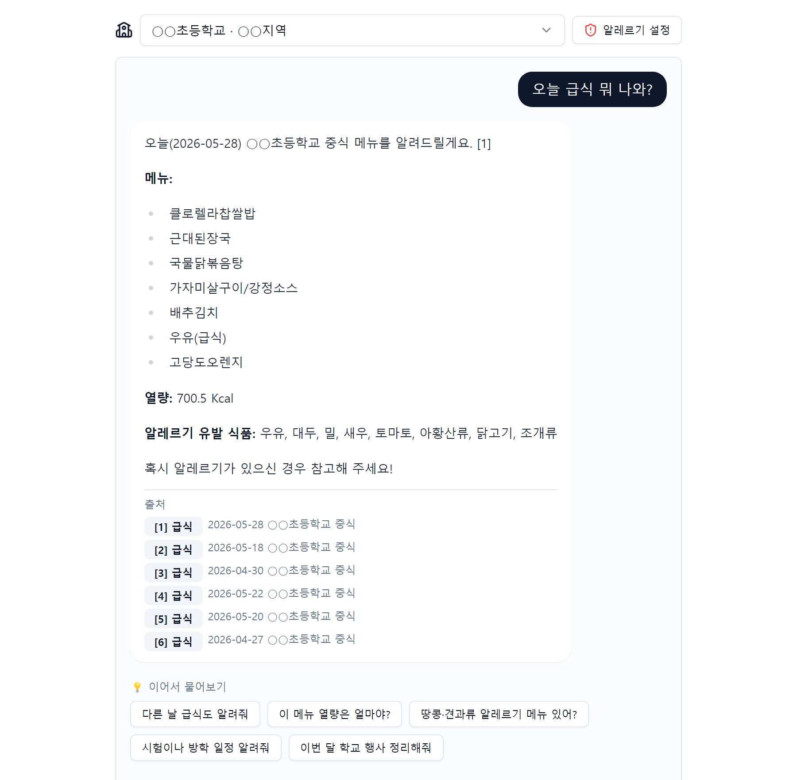
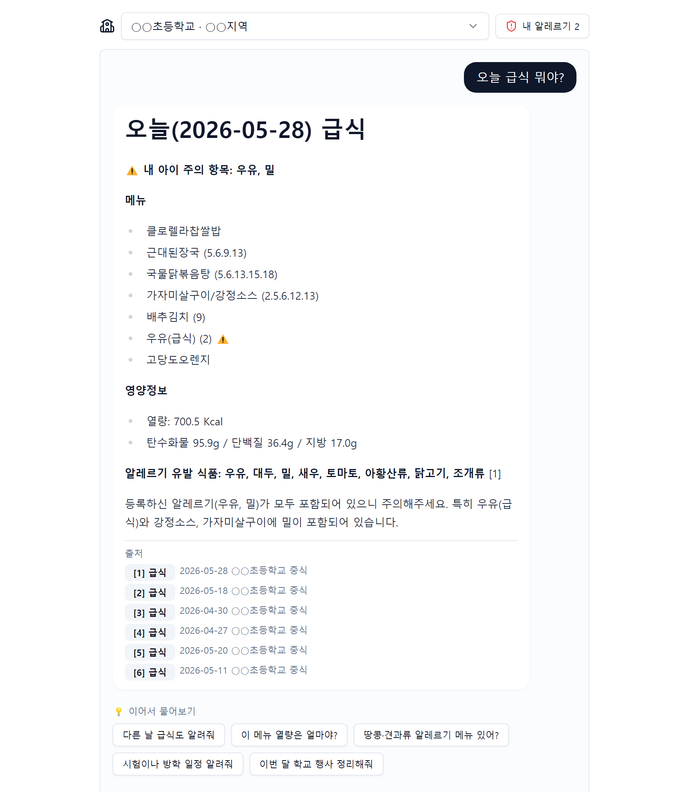
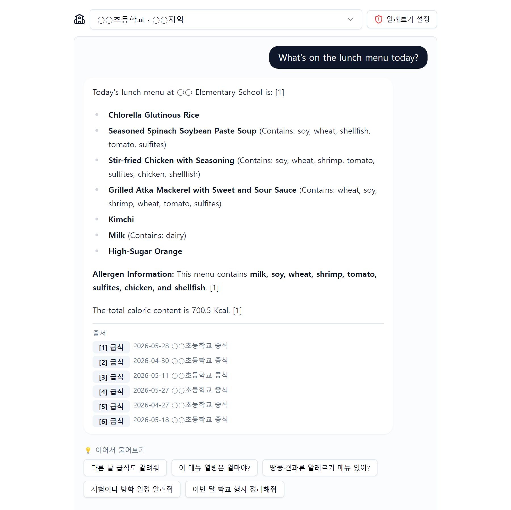
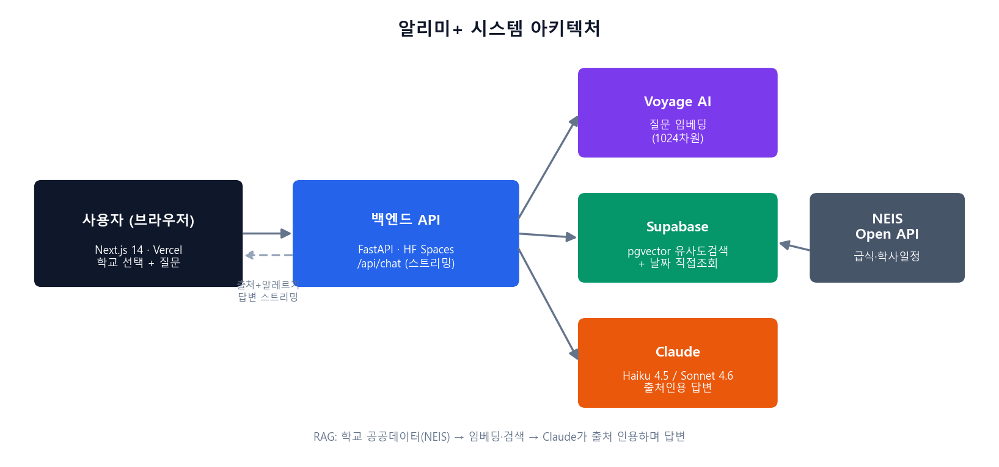

<p align="center">
  
</p>

<h1 align="center">알리미+ (Alrimi+)</h1>

<p align="center">
  학교 공공데이터에 <b>질문 한 줄로</b> 답을 받는 챗봇 — 답변마다 출처를 붙이고, 없는 건 없다고 말합니다.
</p>

<p align="center">
  
  
  
  
  
</p>

---

## 왜 만들었나

급식 메뉴, 시험 일정, 알레르기 정보는 전부 NEIS와 학교알리미에 공개돼 있습니다. 그런데 학부모가 실제로 그걸 보려면 앱을 깔고 학교를 찾고 월간 급식표 PDF를 열어야 합니다. 데이터가 없어서 못 보는 게 아니라 **찾는 비용이 커서 안 보는** 상태입니다.

알리미+는 그 사이를 챗봇으로 메웁니다. 학교를 한 번 고르고 "오늘 급식 뭐야?"라고 물으면 됩니다.

## 무엇을 하나

**학교별 맞춤 답변 + 출처 인용** — NEIS 급식·학사일정을 학교 단위로 검색하고 답변에 쓴 자료를 하단에 그대로 보여줍니다. 지어내지 않았다는 걸 사용자가 직접 확인할 수 있습니다.



**알레르기 개인화** — 아이의 알레르기를 등록해두면 급식 답변 맨 위에 주의 항목이 뜹니다. 이 판정은 LLM이 아니라 파이썬 코드가 NEIS 알레르기 코드(19종)와 등록 항목을 교집합으로 계산합니다. 안전에 직결되는 값을 모델의 판단에 맡기지 않았습니다. 등록 정보는 브라우저 localStorage에만 있고 서버로 가지 않습니다.



**한국어·영어** — 질문한 언어로 답합니다. 다문화 가정 학부모가 모국어로 학교 정보를 받는 걸 염두에 뒀습니다.



## 아키텍처



```
질문
  ↓
[date_intent]  "오늘·이번 주·July 7th" 같은 날짜 의도 파싱 (KST 기준)
  ↓
[하이브리드 검색]  날짜가 특정되면 해당 날짜 급식을 DB에서 직접 조회 → 벡터 검색 결과 앞에 병합
  ↓            (날짜 없는 질문은 pgvector 유사도 검색만)
[알레르기 교차계산]  등록 알레르기 ∩ 메뉴 알레르기 코드 — 코드가 계산, LLM은 관여 안 함
  ↓
[Claude]  검색된 청크만 근거로 답변 생성, 문장마다 [n] 출처 번호 부착
  ↓
NDJSON 스트리밍 (sources → delta → done)
```

| 레이어 | 사용 기술 | 배포처 |
|---|---|---|
| 프론트 | Next.js 14 · TypeScript · Tailwind · shadcn/ui | Vercel |
| 백엔드 | FastAPI · Python 3.11 · Anthropic SDK | Hugging Face Spaces (Docker) |
| 검색 | Supabase PostgreSQL + pgvector (`match_documents` RPC) | Supabase |
| 임베딩 | Voyage AI `voyage-multilingual-2` (1024차원) | — |
| 생성 | Claude Haiku 4.5 기본, 분석형 질문은 Sonnet 4.6 | — |
| 데이터 | NEIS Open API (급식·학사일정), 학교알리미 OpenAPI | — |

## 신뢰성을 위해 한 것

챗봇이 학교 정보를 틀리게 말하면 안 쓰느니만 못합니다. 정확도에 관해선 아래를 지켰습니다.

- **골든 질문 12개 회귀 테스트** — 급식·날짜·알레르기·학사일정·가드·인젝션·타학교·영어를 한 번에 검증. 로컬(`run_golden.py`)과 배포본(`run_golden_live.py`) 양쪽에서 12/12 통과.
- **요일·날짜는 코드가 계산** — 컨테이너가 UTC라 한국 새벽에 '오늘'이 하루 밀리던 버그를 KST 고정으로 잡고 날짜→요일 표를 컨텍스트에 주입해 모델이 요일을 추측하지 않게 했습니다. 10개교 전수 스윕에서 요일 오표기 0건.
- **없으면 없다고 답함** — 주말이나 미등록 날짜를 물으면 검색에 걸린 엉뚱한 날짜를 나열하지 않고 급식이 없다는 사실과 가장 가까운 급식일만 안내합니다.
- **공개 엔드포인트 방어** — IP당 슬라이딩 윈도우 제한 + 전역 상한, 프롬프트 인젝션 패턴은 임베딩 호출 전에 차단, 학교 정보 외 질문은 거절.

데이터가 비어 있는 학교(NEIS에 급식이 거의 등록되지 않은 곳)는 그대로 뒀습니다. 채워 넣으면 시연은 예뻐지지만 원천에 없는 값을 만들어내는 셈이라서요.

## 로컬 실행

```bash
# backend
cd backend
python -m venv .venv && .venv/Scripts/activate    # Windows
pip install -r requirements.txt
cp .env.example .env                              # NEIS / Anthropic / Voyage / Supabase 키 입력
uvicorn app.main:app --reload --port 8000

# frontend
cd frontend
npm install
cp .env.local.example .env.local                  # NEXT_PUBLIC_BACKEND_URL=http://localhost:8000
npm run dev
```

Supabase 스키마는 `backend/app/db/schema.sql`, 학교 시드는 `python -m scripts.seed_schools`, 데이터 적재는 `FORCE=1 python -m scripts.refresh_data`입니다.

## 구조

```
backend/
  app/api/        /api/chat (NDJSON 스트리밍), /api/schools
  app/core/       rag · date_intent · embedding · llm · prompts
  app/data/       NEIS·학교알리미 수집기, 청크 적재기
  app/db/         schema.sql (pgvector + RPC), supabase 클라이언트
  scripts/        시드·적재·골든테스트·제안서 덱 빌더
  tests/          수집기·임베딩·검색·골든질문
frontend/
  app/            랜딩(/), 챗(/chat)
  components/     ChatInterface · SourceCitation · AllergyPicker
  lib/            NDJSON 스트림 파서, 알레르기 코드표
```

## 상태

제8회 교육 공공데이터 AI 활용대회(2026) 일반부 **장려상(후원기관장상)** 수상작입니다. 심사 기간에는 Vercel + Hugging Face Spaces로 실제 운영했다가 심사가 끝난 2026년 7월에 내렸습니다. 위 화면들은 운영 중 캡처입니다.

급식·알레르기 정보는 NEIS 공개 데이터를 그대로 전달할 뿐이므로 실제 섭취 판단은 반드시 학교에 확인해야 합니다.

---

## English

**Alrimi+** is a RAG chatbot over Korean school public data (NEIS meal plans, academic calendars). Ask "what's for lunch today?" and get an answer with the source rows attached.

Award: Encouragement Prize (Sponsoring Organization Award), 8th Korea Education Public Data AI Contest (2026, open division, solo entry).

- **Cited answers** — every response shows the retrieved records it used; no invented facts.
- **Allergy matching in code, not in the model** — the child's registered allergens are intersected with NEIS allergen codes in Python, so a safety-critical result never depends on LLM judgment. Registered allergens stay in browser localStorage.
- **Bilingual (KO/EN)** — answers in the language of the question, including English date expressions ("July 7th", "this week").
- **Date correctness** — KST-pinned "today", weekday table injected into context, no meal data means the app says so instead of listing unrelated dates.

Stack: Next.js 14 (Vercel) · FastAPI (HF Spaces Docker) · Supabase pgvector · Voyage `voyage-multilingual-2` · Claude Haiku 4.5 / Sonnet 4.6.

The live demo was taken down after judging (July 2026); screenshots above are from the production deployment.
